# Vocation.ai 

**Empowering Education & Employment in Rural India through AI ✨**

Vocation.ai is an education and employment platform for youth aged 16-25, especially in rural India, that uses state-of-the-art technology to solve pressing issues. By leveraging cutting-edge AI technology, it empowers rural youth to unlock new opportunities, gain skills, and achieve financial independence.

## 📢 Problem Statement:

> Education and employment are two of the most pressing issues in India, deeply intertwined and contributing significantly to poverty and other socio-economic problems like poor health, high crime, low GDP per capita, and overall low quality of life. Uneducated and unemployed rural youth, who represent a significant 66% of the nation's youth, pose a challenge both to the country's development and to their own future prospects.

**These issues are the primary factors contributing to the challenges in education and employment:**
 
- **Economic Barriers:** Parents in rural India often prevent their children from pursuing education, preferring them to earn a living instead of being a financial burden by studying.
 
- **Lack of Interest:** Children often find studying unengaging, rendering initiatives like midday meals and incentive schemes less effective.
 
- **Delayed Gratification:** Education does not yield immediate benefits, making it less prioritized compared to marriage for girls and immediate employment for boys.
 
- **Lack of Resources:** The educational infrastructure suffers from underqualified teachers, inadequate study resources, and outdated curriculum.
 
- **Accessibility:** Transportation issues, language barriers, and cultural biases further hinder educational opportunities.
 
- **Employment Issues:** Stem largely from inadequate education and skills. Consequently, rural youth are predominantly involved in labour-intensive occupations like agriculture and craftsmanship, leading to an over-reliance on government jobs that do not demand contemporary, real-world skills. This cycle perpetuates socio-economic challenges and limits opportunities for skill development. 
 
Additionally, the lack of career counselling and mentorship means that many young people are unaware of alternative career paths that could offer better income and growth prospects. Furthermore, there is a significant gender disparity in education and employment, with girls and women often facing additional societal and cultural barriers. This not only limits their personal development but also hampers overall community progress.

## 💭 What is Vocation.ai:

> Introducing Vocation.ai, an education and employment platform for youth aged 16-25, especially in rural India, that uses state-of-the-art technology to solve these pressing issues. It is powered by three in-house AI engines: Tutor AI, Job AI, and Quiz AI.

## ✨ Key Features:

- **Tutor AI:**

    Connected to a comprehensive knowledge base which is dynamic and constantly updated automatically through internet access and is curated by admins. Initially, it teaches basic arithmetic, English, and computer skills like MS Excel and typing.

    - **Personalized Learning:** Features a memory system that tracks each student's strengths and weaknesses, topics they covered, and other student memory data, creating a personalized learning experience.

    - **Learning Path Generator:** Can generate a customized and detailed learning path in no time.

    - **V.ai Relax:** When one is tired of studying too much, they can use V.ai Relax to enjoy calming music, inspiring quotes, and ambient images—perfect for a break!

    - **Mindmap Generator:** Generates comprehensive mind maps for quick revision.

    - **YouTube AI:** Summarizes long study lectures into key insights.

    - **Notes AI:** Creates appealing revision notes while utilizing the power of AI simultaneously.

    - **Productivity AI:** Boosts efficiency using AI-powered to-do lists, calendar, and Pomodoro Timer.

    - **V.ai Live:** Enables students to join real-time study sessions with other peer students live on a video call.

    - **Multimodal Features:** Can monitor your webcam and detect your facial emotions for better guidance. Allows file uploads and screen sharing; and at times, it can also act as your mental health counsellor and career mentor.

- **Quiz AI:**

    Generates tests tailored to each student's current knowledge level and learning progress, assessing not just rote learning but also understanding, application, and problem-solving skills.

    - Job Readiness: Based on quiz results, Quiz AI determines a student's readiness for various job opportunities, guiding them towards appropriate employment options.

    - Proctored Environment: Highly proctored where AI monitors webcam activity, shared screen content, and tab switching to prevent cheating.

    - Flashcards: Can generate flashcards for rapid revision and memorization.

    - Subjective Quizzes: Generates subjective quizzes where the AI grades your long answers and provides feedback and scores.

    - Objective Quizzes: Generates MCQ based quizzes with varying difficulty.

- **Job AI:**

    Recommends relevant jobs based on Quiz AI results.

    - **Job Recommendations:** For example, strong performance in English leads to content writing tasks, while proficiency in computer basics results in data entry or annotation tasks.

    - **ResumeAI:** Generates your entire resume with just a few inputs.

    - **InterviewAI:** Transforms your live video call into an interactive interview experience, offering real-time feedback, tailored advice, and asks relevant questions.

- **Side Gigs:**  

    After completing each module, students receive side gigs from Job AI, including opportunities for remote jobs such as:

    - Audio transcription

    - Chat support

    - Scheduling appointments

    - Administrative tasks

    - Content moderation

    - Online tutoring

    - Survey participation

    - Data labelling

    - Content writing

    - Data entry

    - Data annotation

    - Document proofreading

    - Content editing

- **Quality Control:**

    Job AI includes a vision-powered chat system to assist students in reviewing and improving their work before submission, ensuring high-quality output. Students who receive good ratings from employers are given more gigs, while those who underperform receive fewer or no gigs as a form of discipline. This quality control mechanism ensures a high standard of work.

- **Progressive Learning:**

    As students progress, Tutor AI increases the difficulty of lessons, introducing more advanced topics like coding, UI/UX design, no-code app development, and advanced content writing. This ensures continuous skill development and higher-paying job opportunities. Each module lasts from a week to months, depending on the difficulty and depth of topics being taught. Student choice and interests are taken into consideration to decide the topics they study in modules.

- **Community Forum:**

    A community of peers, mentors, and technical admins is available to share learning, clear doubts, give feedback, and make the experience more interactive. Success stories of students securing good jobs or performing well are shared within the community and in the press, inspiring other students and attracting non-users and their parents to join the platform. Successful alumni serve as peer educators, mentoring new students alongside NGO volunteers.

## ⚙️ Technology

### **The technology behind Vocation.ai includes:**

- Vision-Powered Multimodal AI Tutor using the LangChain framework.

- Retrieval-Augmented Generation (RAG) Architecture.

- Supports Face Emotion Recognition from webcam using Face++ API.

- Supports Voice Input and Text-to-Speech using ResponseVoice.JS API.

- Capable of Auto-Grading Homework by leveraging its vision capabilities.

- In-House AI Engines like Quiz AI and Job AI.

- Large Language Models: OpenAI GPT-4 Turbo and Google Gemini-1.5 Pro.

- Vector Embeddings Architecture ensures low latency, less context token cost, and high personalization.

- Student Memory and Knowledge Base storage on multidimensional vector embeddings database - PineconeDB.

- Web Scraping Tools like BeautifulSoup library and Job Search APIs to gather up-to-date job listings and opportunities across various sectors.

- Support for Multiple Indic Languages for inclusivity and ease of access, reducing cultural barriers.

### 🛠️ Backend Architecture Diagram

```mermaid
    %%{init: {'theme': 'neutral', 'themeVariables': { 'primaryColor': '#830C4F', 'primaryTextColor': '#fff', 'primaryBorderColor': '#6a0a3f', 'lineColor': '#830C4F', 'secondaryColor': '#006100', 'tertiaryColor': '#fff'}}}%%
    graph TD
        A((("Vocation.ai<br>Technology"))):::mainNode --> B{{"Tutor AI"}}:::feature
        A --> C{{"Quiz AI"}}:::feature
        A --> D{{"Job AI"}}:::feature
        A --> ASSSA{{"Online Community"}}:::feature
        ASSSA --> SSSSA["Peers, Mentors, and<br>Technical Admins"]
        
        B --> XssaA["RAG Architecture"]
        
        XssaA --> E["LangChain Framework"]
        XssaA --> F["OpenAI GPT-4 Turbo"]
        XssaA --> G["Google Gemini-1.5 Pro"]
        XssaA --> H[("Pinecone DB")]:::database
        
        H --> I["Vector Embeddings"]
        I --> J[("Knowledge Base")]:::database
        J --> QQWQ["Dynamic Knowledge Update<br>through Internet Access"]
        QQWQ --> SFAS["Curated by Admins"]
        I --> K[("Student Memory")]:::database
        K --> DSD["Strengths & Weaknesses,<br>Topics Covered,<br>Learning Style etc."]
        DSD --> DGFS["Adaptive and<br>Personalised Learning"]
        
        B --> L["Multimodal AI"]
        B --> 12HJK["Learning Path Generator"]
        12HJK --> rraaA["Notes AI"]
        rraaA --> sggds[YouTube AI]
        sggds --> ffaggt[Mindmap Generator]
        ffaggt --> gg1121[Productivity AI 'To-Do List AI, Pomodoro Timer & My Calendar']
        gg1121 --> ssq1tt1[V.ai Live 'Live Video-Chat Study Sessions with Peers']
        ssq1tt1 --> sssaa1111[V.ai Relax 'Calming Music, Inspiring Quotes & Ambient Images—perfect for a break']
        L --> SS14["Multiple Indic Languages"]
        SS14 --> DB168["Voice Recognition and<br>Text-To-Speech<br>'ResponseVoice.JS API'"]
        DB168 --> X23100["Face expression detection AI<br>using webcam 'Face++ API'"]
        X23100 --> M["Vision-powered System"]

        M --> SS["Screen Monitoring"]
        M --> DD["File / Image Upload"]

        SS --> XY["Real-Time Guidance"]
        DD --> XY
        XY --> Z141["Autograding Homework<br>using vision capabilities"]
        
        C --> 12DFFF1["Access to Knowledge Base"]
        12DFFF1 --> N["AI-Powered Subjective Quiz, Objective Quiz & Flashcards Generation"]
        1JH23 --> QW["Learning Progress Tracking"]
        N --> O["Test Student Knowledge"]
        O --> 1JH23["Gamification and<br>Reward Points"]
        QW --> HFX["Determine Job Readiness"]
        HFX --> DOP21["AI Proctoring monitors<br>Tab switching, Shared Screen<br>Content and Webcam Activity"]

        D --> R["Job Search APIs &<br>Web Scraping"]
        R --> 4W1["Job Recommendation"]
        4W1 --> S["Remote Job Opportunities"]
        S --> D12["Job Quality<br>Feedback Mechanism"]
        
        D --> T["Vision-powered Chat System"]
        T --> U["Assist with Job Tasks"]
        T --> V["Quality Control"]

        D --> 12HHQ["Resume AI"]
        D --> 14HHQ["Interview AI"]    

        B -.-> C
        C -.-> D
        D -.-> B

        classDef mainNode fill:#830C4F,stroke:#fff,color:#fff;
        classDef database fill:#e1e1e1,stroke:#333,stroke-width:2px;
        classDef feature fill:#830C4F,stroke:#6a0a3f,color:#fff;
```

## 🚀 How to Use:

- **View the Project**: [Prototype Link >](https://vocation-ai.web.app)

- **Local Setup**:  
  - The backend will not run locally due to removed API keys and sensitive credentials.

  - Assets like images, PDFs, and audio files are excluded due to size limitations.

- **Codebase Access**: The full codebase is available for review despite these limitations.

## 💰 Business Model:

1. **Freemium Subscription Model:**
   - Free for underprivileged students after a background check.

   - Paid plans for premium features start at ₹249/month.

2. **Alumni Contributions:**
   - Alumni who have successfully secured well-paying jobs contribute a part of their salary for a specified period. This helps as a regular source of revenue.

3. **Corporate Partnerships:**
   - Collaborations with corporations to fund projects as part of their CSR initiatives.

4. **Local Sponsorships:**
    - Local businesses can sponsor various elements of the platform in different locations, providing additional revenue.

5. **NGO Collaborations:**
   - Partnerships with NGOs for funding and implementation support.
   
6. **Donations:**
   - Accepting donations from individuals and organizations who support our noble mission.

## 🌍 The Impact:

- **Earn While You Learn:** By integrating remote job opportunities with learning modules, Vocation.ai allows students to earn while they learn, easing the financial burden on families and making education a viable option.

- **Engaging Education:** Personalized learning experiences, reward points, and badges keep students engaged, making learning gamified. The AI Tutor adjusts lessons based on individual strengths and weaknesses, making learning relevant and enjoyable.

- **Immediate Benefits:** Immediate job opportunities linked to educational progress provide tangible benefits, encouraging continued education over early marriage for girls or immediate employment for boys.

- **Quality Education:** The AI Tutor compensates for the lack of qualified teachers and modern study materials, providing high-quality, personalized instruction and access to up-to-date educational content.

- **Inclusivity:** Online education and remote job opportunities overcome barriers related to transportation, language, and cultural biases, ensuring inclusivity and broadening access to quality education and employment.

- **Skill Development:** Vocation.ai addresses skill gaps by progressively increasing the difficulty of learning modules and job tasks, ensuring that students acquire contemporary, real-world skills.

- **Market Alignment:** The AI-driven job recommendation system aligns students' skills with market demands, enhancing their employability and career prospects.

- **Community Development:** Vocation.ai revolutionizes rural education and employment, empowering a vast population in rural India to become self-reliant, skilled, and educated, ensuring widespread community development.

- **Gender Equality:** As the platform offers financial incentives, orthodox parents are more likely to permit girls to participate, as they can learn and earn from the safety of their homes. Girls are no longer seen as burdens, as they contribute financially.

- **Societal Transformation:** This transformative approach breaks gender barriers, fosters community progress, and creates a more equitable society where everyone can thrive. It not only uplifts individual students but also fosters overall community progress.

## 🎯 Read Pitchdeck

Explore Vocation.ai’s complete strategy, impact, and technology in detail: [Read Pitchdeck >](https://vocation-ai.web.app/Vocation.ai%20Pitchdeck.pdf)

## 🎉 Future Plans:

- **Community Learning Centres:** Establishing centres to provide resources and support for students without access to devices or the internet.

- **Device Leasing Scheme:** Implementing a program for students lacking access to devices, allowing them to lease devices at minimal or no cost.

- **Strategic Partnerships:** Collaborating with NGOs, schools, community leaders, and government authorities to expand reach and impact.

- **Offline Vocational Training:** Introducing training for trades like carpentry, plumbing, electrical work, tailoring, and others to broaden employment opportunities.

## 🙏 Thank You

Vocation.ai is on a mission to empower India's youth through AI-driven education and employment solutions. We bridge the gap between learning and earning, fostering nation's development and individual growth. Together, we can uplift communities, break down barriers, and foster a society where everyone has the opportunity to thrive.

---

Built with ❤️ for India's bright future.
